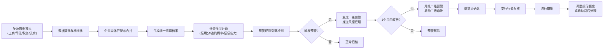

## 1. 产品概述

全国性企业信用与投融资风险评估分析平台，实时接入工商、司法、税务、银行流水等多维度数据源，构建企业统一信用档案，通过智能评分模型实现信用风险全生命周期管理，为银行风控决策提供数据支撑。

- 解决银行信贷风控中数据分散、评估滞后、预警不及时的核心痛点
- 目标用户：银行总行风控部、省分行信贷管理部、市支行客户经理
- 核心价值：降低不良贷款率、提升风控效率、实现风险早发现早处置

## 2. 核心功能

### 2.1 用户角色与权限

| 角色 | 注册方式 | 核心权限 |
|------|----------|----------|
| 总行管理员 | 系统分配 | 全国数据查看、全局配置管理、用户权限管理、三级审批最终决策 |
| 省分行主管 | 系统分配 | 所辖省份数据查看、省级报表导出、二级预警处置审批 |
| 市支行经理 | 系统分配 | 所辖地市数据查看、企业详情查询、一级预警确认反馈 |
| 风控分析师 | 系统分配 | 模型配置、报告生成、风险策略制定 |

### 2.2 功能模块清单

1. **核心看板**：全国信用热力图、违约率排名、关键指标概览、省份下钻分析
2. **企业档案**：企业统一信用画像、多源数据融合、财务趋势分析
3. **预警中心**：一级/二级预警列表、预警详情、处置流程跟踪
4. **财报分析**：财报上传解析、财务比率计算、行业均值对比、异常诊断
5. **审批流程**：三级审批工作台、授信调整申请、贷后处理启动
6. **报告中心**：周度健康报告、专项风险报告、自定义报表导出
7. **系统管理**：用户权限、数据源配置、模型参数、行业标准维护

### 2.3 页面详情

| 页面名称 | 模块名称 | 功能描述 |
|----------|----------|----------|
| 核心看板 | 热力图模块 | 全国省份信用评分热力图，支持按行业/规模筛选，点击省份下钻至地市 |
| 核心看板 | 排名模块 | 违约率TOP10行业/地区排名，信用分下降最快企业榜 |
| 核心看板 | 指标卡片 | 总体违约率、平均信用分、预警企业数、授信使用率等KPI |
| 核心看板 | 趋势图表 | 近6个月违约率走势、行业信用分对比柱状图 |
| 企业列表 | 筛选区 | 按地区、行业、规模、信用等级、预警状态多维度筛选 |
| 企业列表 | 数据表格 | 企业名称、统一信用代码、所属地区、行业、信用分、违约概率、预警状态 |
| 企业详情 | 基本信息 | 工商注册信息、股东结构、高管信息、关联企业图谱 |
| 企业详情 | 信用画像 | 信用评分雷达图、历史评分曲线、违约概率趋势 |
| 企业详情 | 财务分析 | 资产负债表、利润表、现金流量表关键指标，偿债能力指数 |
| 企业详情 | 风险标签 | 司法涉诉、税务异常、行政处罚、负面舆情标签 |
| 预警中心 | 预警列表 | 一级/二级预警分类展示，预警等级、触发原因、触发时间、处置状态 |
| 预警中心 | 预警详情 | 预警触发指标详情、历史数据对比、推荐处置方案、处置记录时间线 |
| 财报分析 | 上传区 | 支持Excel财报/审计报告拖拽上传，模板下载 |
| 财报分析 | 解析结果 | 自动提取关键财务比率，与行业均值对比，偏离度可视化 |
| 财报分析 | 异常分析 | 指标偏离超过30%自动标记，生成异常分析报告和尽调建议 |
| 审批工作台 | 待办列表 | 待我审批、我已审批、抄送我的三级审批事项 |
| 审批工作台 | 审批详情 | 授信调整/贷后处理申请详情，审批意见输入，附件上传 |
| 报告中心 | 报告列表 | 周度健康报告、月度分析报告、专项风险报告列表 |
| 报告中心 | 报告预览 | 报告在线查看、PDF导出、邮件推送 |
| 系统管理 | 用户管理 | 用户增删改查、角色分配、权限配置 |
| 系统管理 | 数据源管理 | 数据源接入状态、同步日志、配置参数 |

## 3. 核心流程

### 3.1 数据处理与评分流程

### 3.2 财报分析流程

### 3.3 用户主操作流程

1. 用户登录 → 根据角色权限展示对应数据范围 → 查看核心看板 → 点击热力图省份下钻 → 查看地市信用分布 → 点击企业查看详情
2. 风控经理登录 → 查看预警中心待处理预警 → 核实预警信息 → 填写处置意见 → 跟踪处置进度
3. 信贷员登录 → 上传企业财报 → 查看系统解析结果 → 根据异常分析制定尽调方案

## 4. 用户界面设计

### 4.1 设计风格

**金融科技专业风格**，强调数据可视化的清晰度和专业感

- **主色调**：深蓝色系 (#165DFF) 代表专业、信任、金融属性
- **辅助色**：
  - 成功绿 (#00B42A) 正常状态
  - 警告橙 (#FF7D00) 一级预警
  - 危险红 (#F53F3F) 二级预警/高风险
  - 信息灰 (#86909C) 次要信息
- **中性色**：#1D2129 / #4E5969 / #86909C / #C9CDD4 / #F2F3F5 / #FFFFFF
- **按钮风格**：圆角 6px，实心主按钮 + 描边次按钮 + 文字按钮三级体系
- **字体**：
  - 标题：思源黑体 Bold，字号 18-28px
  - 正文：思源黑体 Regular，字号 14px
  - 数据：等宽字体，增强数字可读性
- **布局风格**：卡片式布局，清晰的视觉层级，数据表格 + 图表组合呈现
- **图标风格**：线性图标，统一 1.5px 描边，圆角端点
- **动效**：数据加载骨架屏、图表渐入动画、表格行悬停高亮

### 4.2 页面设计概览

| 页面名称 | 模块名称 | UI 元素 |
|----------|----------|---------|
| 核心看板 | 顶部导航 | Logo、系统名称、全局搜索、消息通知、用户头像下拉 |
| 核心看板 | 侧边菜单 | 功能模块导航、当前位置展开、收起/展开按钮 |
| 核心看板 | KPI 指标区 | 4张数据卡片，包含数值、同比环比、趋势小图、状态标签 |
| 核心看板 | 热力图区 | 中国地图着色热力图，顶部行业/时间筛选器，hover提示框 |
| 核心看板 | 排名区 | 两个并排排行榜，行业违约率TOP10、地区违约率TOP10 |
| 核心看板 | 趋势图区 | 双Y轴折线图，违约率与预警数量趋势对比 |
| 企业详情 | 头部信息 | 企业名称、信用等级徽章、基本信息标签组、快捷操作按钮 |
| 企业详情 | 标签导航 | 基本信息、信用画像、财务分析、风险信息、预警记录 |
| 企业详情 | 信用分仪表盘 | 半圆仪表盘，指针指示当前信用分，色阶区分等级 |
| 企业详情 | 财务表格 | 斑马纹数据表格，支持排序，异常数据红色标记 |
| 预警中心 | 顶部筛选 | 预警等级、时间范围、处置状态、行业/地区筛选 |
| 预警中心 | 预警卡片 | 红色/橙色卡片区分等级，企业名称、预警原因、触发时间、处置按钮 |
| 审批工作台 | 流程条 | 三级审批进度指示条，当前节点高亮 |
| 财报分析 | 上传区 | 虚线拖拽区域，文件图标 + 上传按钮 + 模板下载链接 |

### 4.3 响应式设计

- **优先设计**：桌面端优先 (1920px / 1440px)
- **适配范围**：最小支持 1280px 宽度
- **平板适配**：侧边栏可折叠为图标模式，数据表格可横向滚动
- **数据展示优化**：小屏幕下图表自适应重排，关键指标优先展示

### 4.4 数据可视化规范

- **热力图**：采用 5 档色阶，从浅蓝到深蓝表示信用分从低到高，红色标记高风险地区
- **折线图**：最多展示 4 条线，使用不同线型和标记点区分
- **柱状图**：支持正负值双向展示，负值用红色
- **雷达图**：5-8 个维度，填充半透明色增强视觉效果
- **仪表盘**：0-100 分，分 5 个等级区域，指针动画效果
