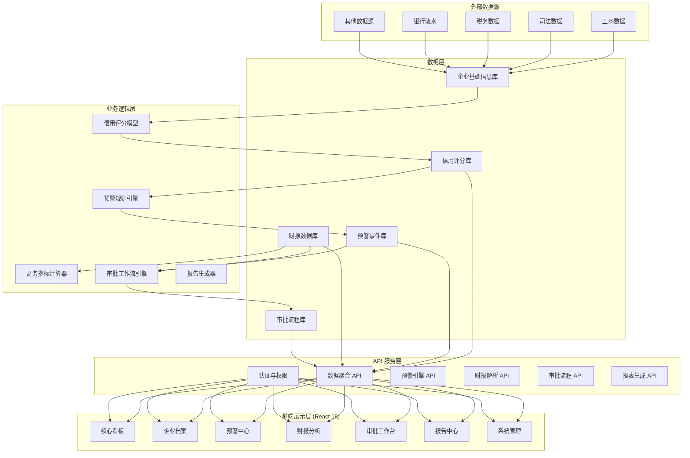

## 1. 架构设计



## 2. 技术选型说明

### 2.1 前端技术栈
- **框架**：React 18 + TypeScript
- **构建工具**：Vite 5
- **样式方案**：TailwindCSS 3.4
- **UI 组件库**：Ant Design 5
- **图表库**：ECharts 5 + @ant-design/charts
- **地图可视化**：ECharts 中国地图
- **状态管理**：Zustand
- **路由**：React Router v6
- **HTTP 客户端**：Axios
- **文件处理**：xlsx (Excel解析)
- **日期处理**：dayjs
- **拖拽上传**：react-dropzone

### 2.2 Mock 数据方案
- 使用 MSW (Mock Service Worker) 模拟后端 API
- 构建完整的模拟数据集，包含全国31个省份、约2000家模拟企业数据
- 模拟实时数据更新效果

## 3. 路由定义

| 路由路径 | 页面名称 | 说明 |
|----------|----------|------|
| / | 登录页 | 用户登录入口 |
| /dashboard | 核心看板 | 全国信用热力图、KPI指标、排行榜 |
| /dashboard/province/:provinceCode | 省份下钻看板 | 选中省份的地市信用分布 |
| /enterprises | 企业列表 | 企业列表查询、筛选 |
| /enterprises/:id | 企业详情 | 企业信用档案、财务分析 |
| /alerts | 预警中心 | 一级/二级预警列表、处置 |
| /alerts/:id | 预警详情 | 预警详情、处置流程 |
| /financial | 财报分析 | 财报上传、解析、异常分析 |
| /approval | 审批工作台 | 三级审批待办、已办 |
| /approval/:id | 审批详情 | 审批详情、意见填写 |
| /reports | 报告中心 | 周度报告、专项报告 |
| /reports/:id | 报告详情 | 报告预览、导出 |
| /system/users | 用户管理 | 系统用户、角色配置 |
| /system/datasources | 数据源管理 | 数据源配置、同步状态 |

## 4. 数据模型定义

### 4.1 核心数据类型定义

```typescript
// 企业信息
interface Enterprise {
  id: string;
  name: string;
  unifiedCreditCode: string;
  legalPerson: string;
  registeredCapital: number;
  establishmentDate: string;
  province: string;
  provinceCode: string;
  city: string;
  cityCode: string;
  industry: string;
  industryCode: string;
  scale: 'large' | 'medium' | 'small' | 'micro';
  creditScore: number;
  creditLevel: 'AAA' | 'AA' | 'A' | 'BBB' | 'BB' | 'B' | 'CCC' | 'CC' | 'C';
  defaultProbability: number;
  debtSolvencyIndex: number;
  assetLiabilityRatio: number;
  alertStatus: 'normal' | 'level1' | 'level2' | 'resolved';
  creditScoreHistory: { date: string; score: number }[];
  updateTime: string;
}

// 预警信息
interface Alert {
  id: string;
  enterpriseId: string;
  enterpriseName: string;
  level: 'level1' | 'level2';
  triggerType: 'score_drop' | 'debt_ratio_exceed' | 'other';
  triggerReason: string;
  triggerDetail: {
    metricName: string;
    currentValue: number;
    threshold: number;
    changeRate?: number;
  };
  triggerTime: string;
  status: 'pending' | 'processing' | 'resolved' | 'escalated';
  handler?: string;
  resolution?: string;
  resolutionTime?: string;
  approvalProcessId?: string;
}

// 审批流程
interface ApprovalProcess {
  id: string;
  alertId: string;
  enterpriseName: string;
  type: 'credit_adjust' | 'post_loan';
  currentStep: 1 | 2 | 3;
  status: 'pending' | 'approved' | 'rejected';
  steps: {
    step: 1 | 2 | 3;
    role: string;
    handler: string;
    status: 'pending' | 'approved' | 'rejected';
    opinion?: string;
    handleTime?: string;
  }[];
  proposedAdjustment?: {
    originalCreditLine: number;
    proposedCreditLine: number;
    reason: string;
  };
  createTime: string;
}

// 财务分析结果
interface FinancialAnalysis {
  id: string;
  enterpriseId: string;
  enterpriseName: string;
  reportPeriod: string;
  uploadTime: string;
  keyRatios: {
    name: string;
    value: number;
    industryAverage: number;
    deviationRate: number;
    isAbnormal: boolean;
  }[];
  abnormalItems: {
    ratioName: string;
    value: number;
    industryAverage: number;
    deviationRate: number;
    analysis: string;
    dueDiligenceSuggestion: string;
  }[];
  overallAssessment: string;
}

// 周度健康报告
interface WeeklyReport {
  id: string;
  weekNumber: number;
  year: number;
  startDate: string;
  endDate: string;
  keyMetrics: {
    overallDefaultRate: number;
    defaultRateYoY: number;
    defaultRateMoM: number;
    industryConcentration: { industry: string; ratio: number }[];
    creditUtilizationRate: number;
  };
  trendComparison: {
    metric: string;
    currentWeek: number;
    lastWeek: number;
    change: number;
  }[];
  riskStrategyRecommendations: string[];
  keyMonitoringList: {
    enterpriseName: string;
    industry: string;
    region: string;
    riskReason: string;
  }[];
}

// 省份信用数据
interface ProvinceCreditData {
  provinceCode: string;
  provinceName: string;
  avgCreditScore: number;
  defaultRate: number;
  alertCount: number;
  enterpriseCount: number;
  cities: {
    cityCode: string;
    cityName: string;
    avgCreditScore: number;
    defaultRate: number;
    enterpriseCount: number;
  }[];
}

// 用户信息
interface User {
  id: string;
  username: string;
  name: string;
  role: 'headquarters' | 'provincial' | 'municipal' | 'analyst';
  region?: string;
  regionCode?: string;
  permissions: string[];
}
```

## 5. 数据模型关系图

```mermaid
erDiagram
    USER ||--o{ ALERT : "处理"
    USER ||--o{ APPROVAL_PROCESS : "审批"
    ENTERPRISE ||--o{ CREDIT_SCORE_HISTORY : "拥有"
    ENTERPRISE ||--o{ ALERT : "触发"
    ENTERPRISE ||--o{ FINANCIAL_REPORT : "拥有"
    ENTERPRISE ||--o{ APPROVAL_PROCESS : "关联"
    ALERT ||--o| APPROVAL_PROCESS : "升级为"
    FINANCIAL_REPORT ||--o{ FINANCIAL_RATIO : "包含"
    
    USER {
        string id
        string username
        string name
        enum role
        string region
    }
    
    ENTERPRISE {
        string id
        string name
        string unifiedCreditCode
        string province
        string industry
        enum scale
        number creditScore
        number defaultProbability
        enum alertStatus
    }
    
    CREDIT_SCORE_HISTORY {
        string id
        string enterpriseId
        date date
        number score
    }
    
    ALERT {
        string id
        string enterpriseId
        enum level
        string triggerReason
        datetime triggerTime
        enum status
        string handlerId
    }
    
    APPROVAL_PROCESS {
        string id
        string alertId
        string enterpriseId
        enum type
        int currentStep
        enum status
        datetime createTime
    }
    
    FINANCIAL_REPORT {
        string id
        string enterpriseId
        string reportPeriod
        datetime uploadTime
        string overallAssessment
    }
    
    FINANCIAL_RATIO {
        string id
        string reportId
        string name
        number value
        number industryAverage
        number deviationRate
        boolean isAbnormal
    }
```



## 6. 核心模块数据结构

### 6.1 信用评分模型输入输出
```typescript
interface CreditScoreInput {
  basicInfo: {
    establishmentYears: number;
    registeredCapital: number;
    industryRiskLevel: number;
  };
  financialIndicators: {
    assetLiabilityRatio: number;
    currentRatio: number;
    netProfitMargin: number;
    revenueGrowthRate: number;
  };
  publicRecords: {
    lawsuitCount: number;
    taxAbnormalCount: number;
    penaltyCount: number;
  };
  bankBehavior: {
    loanRepaymentHistory: number;
    cashFlowStability: number;
  };
}

interface CreditScoreOutput {
  totalScore: number;
  level: string;
  defaultProbability: number;
  dimensionScores: {
    basicQualification: number;
    financialHealth: number;
    publicCredit: number;
    bankBehavior: number;
  };
}
```

### 6.2 预警规则配置
```typescript
interface AlertRule {
  id: string;
  name: string;
  metric: string;
  condition: 'drop_rate' | 'exceed_threshold' | 'below_threshold';
  threshold: number;
  durationMonths: number;
  level: 'level1' | 'level2';
  enabled: boolean;
}
```
